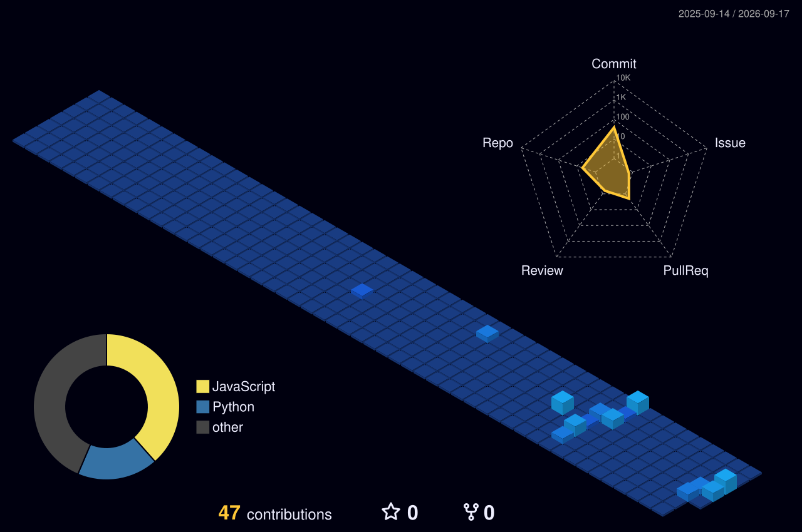

<!-- 배너 이미지를 assets/banner.png (또는 .gif) 로 올리면 됨 -->

  

 

  

 

<picture>
  <source media="(prefers-color-scheme: dark)" srcset="https://raw.githubusercontent.com/loooopy26/loooopy26/output/github-snake-dark.svg"/>
  <source media="(prefers-color-scheme: light)" srcset="https://raw.githubusercontent.com/loooopy26/loooopy26/output/github-snake.svg"/>
  
</picture>

 

  

 

### Projects

  
  
  
  

 

  

